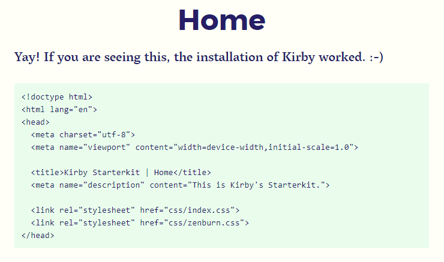

# Kirby3 Highlight
[](https://github.com/S1SYPHOS/kirby3-highlight/releases) [](https://github.com/S1SYPHOS/kirby3-highlight/blob/master/LICENSE) [](https://github.com/S1SYPHOS/kirby3-highlight/issues)

This plugin highlights your code snippets server-side - without external dependencies.

- Code highlighting for everyone - no javascript needed
- Comprehensive: supports [185 languages](https://github.com/scrivo/highlight.php/tree/master/Highlight/languages)
- Customisable: [89 different styles](https://github.com/S1SYPHOS/kirby3-highlight/tree/master/assets/css) included



**Table of contents**
- [1. Getting started](#getting-started)
- [2. Configuration](#configuration)
- [3. Styling](#styling)
- [4. Troubleshooting](#troubleshooting)
- [5. Credits / License](#credits--license)

## Getting started
Use one of the following methods to install & use `kirby3-highlight`:

### Git submodule

If you know your way around Git, you can download this plugin as a [submodule](https://github.com/blog/2104-working-with-submodules):

```text
git submodule add https://github.com/S1SYPHOS/kirby3-highlight.git site/plugins/kirby-highlight
```

### Composer

```text
composer require s1syphos/kirby3-highlight
```

### Clone or download

1. [Clone](https://github.com/S1SYPHOS/kirby3-highlight.git) or [download](https://github.com/S1SYPHOS/kirby3-highlight/archive/master.zip) this repository.
2. Unzip / Move the folder to `site/plugins`.

Now proper classes are added to your code snippets, making  them 'themeable'. In order to do so, head over to the [styling](#styling) section.

## Configuration
Change `kirby-highlight` options to suit your needs:

| Option | Type | Default | Description |
| --- | --- | --- | --- |
| `s1syphos.highlight.class` | String | `'hljs'` | Adds one or more classes to the preceding `pre` element. |
| `s1syphos.highlight.languages` | Array | `['html', 'php']` | Defines languages to be auto-detected (currently 176 languages are supported). |
| `s1syphos.highlight.escaping` | Boolean | `false` | Enables character escaping (converting `<` to `&lt;`, `>` to `&gt;`, ..), see `htmlspecialchars()` [docs](http://php.net/manual/en/function.htmlspecialchars.php). |

## Styling
All `highlight.js` styles are fully compatible with `kirby3-highlight`. Just include it using the `css()` [helper](https://getkirby.com/docs/cheatsheet/helpers/css):

```
<?= css('/media/plugins/s1syphos/highlight/css/zenburn.css') ?>
```

## Troubleshooting
If in doubt, check the [correct spelling](https://github.com/S1SYPHOS/kirby3-highlight/tree/master/vendor/scrivo/highlight.php/Highlight/languages) of the language in question - doing otherwise might break `kirbytext()`.

## Credits / License
`kirby3-highlight` is based on Geert Bergman's [`highlight.php`](https://github.com/scrivo/highlight.php) library (a PHP port of [highlight.js](https://highlightjs.org)). It is licensed under the [MIT License](LICENSE), but **using Kirby in production** requires you to [buy a license](https://getkirby.com/buy).

## Special Thanks
I'd like to thank everybody that's making great software - you people are awesome. Also I'm always thankful for feedback and bug reports :)
